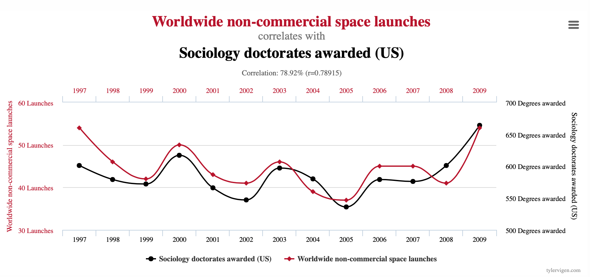

<style type="text/css">
.remark-slide-content {
    font-size: 30px;
    padding: 1em 1em 1em 1em;
}
</style>

```{r , include = F}
options(htmltools.dir.version = FALSE)
library(pacman)
p_load(ggthemes, viridis, knitr, extrafont, tidyverse, magrittr, latex2exp, 
       parallel, Ecdat, wooldridge, dslabs, ggforce, emo, png, grid, pander, 
       countdown, emoGG, haven)


options(htmltools.dir.version = FALSE)

# define vars
om = par("mar")
lowtop = c(om[1],om[2],0.1,om[4])

overwrite = FALSE


# Define colors
red_pink <- "#e64173"
met_slate <- "#23373b" # metropolis font color
# Notes directory
# Knitr options
opts_chunk$set(
  comment = "#>",
  fig.align = "center",
  fig.height = 7,
  fig.width = 10.5,
  #dpi = 300,
  #cache = T,
  message = FALSE,
  warning = FALSE,
  dev = "svg",
  cache = TRUE
  #fig.width = 11,
  #fig.height = 5
)

theme_simple <- theme_bw() + theme(
  axis.line = element_line(color = met_slate),
  panel.grid = element_blank(),
  rect = element_blank(),
  strip.text = element_blank(),
  text = element_text(family = "Fira Sans", color = met_slate, size = 14),
  axis.text.x = element_text(size = 12),
  axis.text.y = element_text(size = 12),
  axis.ticks = element_blank(),
  plot.title = element_blank(),
  legend.position = "none"
)
theme_empty <- theme_bw() + theme(
  line = element_blank(),
  rect = element_blank(),
  strip.text = element_blank(),
  axis.text = element_blank(),
  plot.title = element_blank(),
  axis.title = element_blank(),
  plot.margin = structure(c(0, 0, -1, -1), unit = "lines", valid.unit = 3L, class = "unit"),
  legend.position = "none"
)

# countdown style
countdown(
  color_border              = "#d90502",
  color_text                = "black",
  color_running_background  = "#d90502",
  color_running_text        = "white",
  color_finished_background = "white",
  color_finished_text       = "#d90502",
  color_finished_border     = "#d90502"
)


```


```{r Setup, include = F}
options(htmltools.dir.version = FALSE)
library(pacman)
p_load(ggthemes, viridis, knitr, extrafont, tidyverse, magrittr, latex2exp, parallel, Ecdat, wooldridge, dslabs, ggforce)
# Define colors
red_pink <- "#e64173"
met_slate <- "#23373b" # metropolis font color
# Notes directory
# Knitr options
opts_chunk$set(
  comment = "#>",
  fig.align = "center",
  fig.height = 7,
  fig.width = 10.5,
  #dpi = 300,
  #cache = T,
  warning = F,
  message = F
)  
theme_simple <- theme_bw() + theme(
  axis.line = element_line(color = met_slate),
  panel.grid = element_blank(),
  rect = element_blank(),
  strip.text = element_blank(),
  text = element_text(family = "Fira Sans", color = met_slate, size = 14),
  axis.text.x = element_text(size = 12),
  axis.text.y = element_text(size = 12),
  axis.ticks = element_blank(),
  plot.title = element_blank(),
  legend.position = "none"
)
theme_empty <- theme_bw() + theme(
  line = element_blank(),
  rect = element_blank(),
  strip.text = element_blank(),
  axis.text = element_blank(),
  plot.title = element_blank(),
  axis.title = element_blank(),
  plot.margin = structure(c(0, 0, -1, -1), unit = "lines", valid.unit = 3L, class = "unit"),
  legend.position = "none"
)

df_nhis <- read_dta("NHIS2009_clean.dta")

```


# Today's Lecture

- Our First Causal Question in Real Life
      - Causality
      - Correlation v. Causation
      - Other things equal 

- Selection Bias


---
# Causal Inference to Inform Policy: Setting

Access to health care insurance is a huge political issue in the US. Subsidizing the provision and mandating the adoption of insurance was at the core of the, heavily debated, Affordable Health Care Act, also known as *Obamacare*. 

__Policy:__ Subsidize, and/or enforce, a health care insurance for the entire population.  

__Rationale:__ Increasing access to health care (through insurance), can improve the health outcomes of the population. 
  - Can you think of another rationale? 
    
Let's look at some data to investigate this rationale.

---
# National Health Interview Survey, 2009 

.pull-left[
- This is just a random sample of 100 observations from the real dataset. The complete data contains `r dim(df_nhis)[1]` observations (individuals). 

]


.pull-right[
.font70[
```{r, echo=FALSE, eval=TRUE}

df_nhis_sample <- df_nhis %>% 
  sample_n(100) %>% 
  select(hi, fml, age, hlth, perweight)


DT::datatable(
  df_nhis_sample,
  caption = c("2009 National Health Interview Survey"),
  colnames = c('<span style="color: #007935 !important">Insurance<?/span>', '<span style="color: #007935 !important">Female?</span>', '<span style="color: #007935 !important">Age</span>', '<span style="color: #007935 !important">Health</span>', '<span style="color: #007935 !important">Weight</span>'),
  fillContainer = FALSE, options = list(pageLength = 6, lengthChange = FALSE, searching = FALSE), escape = FALSE) %>%
  DT::formatStyle('hi', color = '#9370DB') %>%
  DT::formatStyle('fml', color = '#9370DB') %>%
  DT::formatStyle('age', color = '#9370DB') %>%
  DT::formatStyle('hlth', color = '#9370DB') %>%
  DT::formatStyle('perweight', color = '#9370DB') %>%
  DT::formatStyle(0, color = '#FD5F00')
```
]
]


---
# National Health Interview Survey, 2009 

.pull-left[
- This is just a random sample of 100 observations from the real dataset. The complete data contains `r dim(df_nhis)[1]` observations (individuals). 

- What tools from the course (so far) should we use to look at this data?
]


.pull-right[
.font70[
```{r, echo=FALSE, eval=TRUE}


DT::datatable(
  df_nhis_sample,
  caption = c("2009 National Health Interview Survey"),
  colnames = c('<span style="color: #007935 !important">Insurance<?/span>', '<span style="color: #007935 !important">Female?</span>', '<span style="color: #007935 !important">Age</span>', '<span style="color: #007935 !important">Health</span>', '<span style="color: #007935 !important">Weight</span>'),
  fillContainer = FALSE, options = list(pageLength = 6, lengthChange = FALSE, searching = FALSE), escape = FALSE) %>%
  DT::formatStyle('hi', color = '#9370DB') %>%
  DT::formatStyle('fml', color = '#9370DB') %>%
  DT::formatStyle('age', color = '#9370DB') %>%
  DT::formatStyle('hlth', color = '#9370DB') %>%
  DT::formatStyle('perweight', color = '#9370DB') %>%
  DT::formatStyle(0, color = '#FD5F00')
```
]
]


---
background-image: url("Images/MMtbl11.png")
background-size: contain


# National Health Interview Survey, 2009 (MM, Ch1)


---
background-image: url("Images/MMtbl11_notes.png")
background-size: contain


# National Health Interview Survey, 2009: Notes 

---
background-image: url("Images/MMtbl11_notes.png")
background-size: 100%
background-position: 50% 100%


# National Health Interview Survey, 2009: Notes 


---
background-image: url("Images/MMtbl11.png")
background-size: 70%
background-position: 60% 20%


# Let's Read This Summary Statistics

.pull-left[
.font110[
- $\mathop{\mathbb{E}}(Y|X)$ ?
- $\sigma$ ?
]
]


---
background-image: url("Images/MMtbl11_health.png")
background-size: 60%
background-position: 100% 50%


# National Health Interview Survey, 2009 (MM, Ch1)

.pull-left[
.font130[
- Can we interpret <br>
these differences <br>
**causally**?
]
]

---

# The Concept of Causality

__Causality__: what are we talking about? 

- We say that $X$ *causes* $Y$

--

  - if we were to intervene and *change* the value of $X$ ***without changing anything else***...
    
--

  - then $Y$ would also change ***as a result***.
  
--

- The key point here is the ***without changing anything else***, often referred as the **other things equal** assumption (or *ceteris paribus* if you want to sound fancy).   


--

- `r emo::ji("warning")` It does **NOT** mean that $X$ is the only factor that causes $Y$.

---
# Correlation vs Causation

***Correlation does not equal causation*** has become a ubiquitous mantra, but can you tell why it is true?

--

Some correlations obviously don't imply causation ([e.g. spurious correlation website](https://www.tylervigen.com/spurious-correlations)).

--

```{r, echo = FALSE, out.width = "800px"}

```


---
background-image: url("Images/Smoking_lung_cancer.png")
background-size: 40%
background-position: 10% 70% 

# Correlation vs Causation: Smoking and Lung Cancer
.pull-left[
.font90[But not all correlations are so easy to rule out]
]

.pull-right[
.font90[
***Does smoking cause lung cancer?***

- Today, we know the answer is *YES*! 

- But let's go back in the 1950's

  - We are at the start of a big increase in deaths from lung cancer...
  
  - ... which is happening after a fast growth in cigarette consumption

- It's very tempting to claim that smoking causes lung cancer based on this graph.
]
]

---

# Correlation vs Causation: Smoking and Lung Cancer

At the time many people were still skeptical, including some famous statisticians:


.pull-left[
.font90[
Macro confounding factors:

Other macro factors which can cause cancers also changed between 1900 and 1950:

  - Tarring of roads,
  
  - Inhalation of motor exhausts (leaded gasoline fumes),
  
  - General greater air pollution.
  ]
]


.pull-right[
.font90[
Self selection:

Smokers and non-smokers may be different in the first place: 
  
  - __Selection on observable characteristics__: age, education, income, etc.
  
  - __Selection on unobservable characteristics__: genes (the hypothetical confounding genome theory of [Fisher](https://en.wikipedia.org/wiki/Ronald_Aylmer_Fisher)). 
  ]
]

---
background-image: url("Images/MMtbl11_health.png")
background-size: 60%
background-position: 100% 50%


# .font90[Back to Our Original Example: Health and Health Insurance]

.pull-left[
.font130[
- Can we interpret <br>
these differences <br>
**causally**?

- Are all **other** <br>
**things equal** between <br>
insured and uninsured?
]
]

---
# Selection Bias 
[Wikipedia Definition](https://en.wikipedia.org/wiki/Selection_bias):
>Selection bias is the bias introduced by the selection of individuals, groups, or data for analysis in such a way that proper randomization is not achieved, thereby failing to ensure that the sample obtained is representative of the population intended to be analyzed. 

- Econometric textbooks, tend to define selection bias in term of a regression or (as MM) a randomized controlled trial. 

- We will start from this more general definition to connect with the concept of **conditional expectation**. 

- Then we will connect with regression and experiments.  


---
background-image: url("Images/Survivorship-bias.png")
background-size: contain


# SB Example 1: Airplanes in World War II

---
background-image: url("Images/Survivorship-bias.png")
background-size: 40%
background-position: 100% 50%


# .font80[SB Example 1: Airplanes in World War II. Using Expectation 1/2]


.pull-left[
.font70[

- How would you use conditional expectations to characterize this problem? 

- Let's start by simplifying the problem by assuming that each plane only had two sections. Now define two random variables: binary variables (bernulli) to indicate if the plane received damage in locations one, and two.   $(DL1:\{\text{No damaged in lct 1, Damaged in lct} 1\} \to \{0,1\}$, same for $DL2)$. 

- We also need to define random variable for that we are conditioning on. In this case, let's use a binary variable for return $(R:\{\text{Plane didn't return, Plane returned} \}\to\{0,1\})$


]
]

---
background-image: url("Images/Survivorship-bias.png")
background-size: 40%
background-position: 100% 50%

# .font80[SB Example 1: Airplanes in World War II. Using Expectation 2/2]


.pull-left[
.font70[

- One way of characterizing the problem would be that the engineers thought they where observing $\mathop{\mathbb{E}}(DL1)$ and $\mathop{\mathbb{E}}(DL2)$ and concluding $\mathop{\mathbb{E}}(DL1) > \mathop{\mathbb{E}}(DL2)$. 

- But in they were actually observing $\mathop{\mathbb{E}}(DL1|R=1)$ and $\mathop{\mathbb{E}}(DL2|R=1)$ and most likely $\mathop{\mathbb{E}}(DL1|R=0) < \mathop{\mathbb{E}}(DL2|R=0)$ 

- If you don't like the math notation, you can provide the same answer, but in narrative form. 

- This is called [survivorship bias](https://en.wikipedia.org/wiki/Survivorship_bias), and is a type of selection bias. 
]
]


---
background-image: url("Images/MMtbl11_health.png")
background-size: 50%
background-position: 100% 50%
# SB Example 2: Health Insurance 1/2
.font70[
.pull-left[
- We can do something similar for our health insurance example. 
- The "hidden" information could be many things. For example: maybe uninsured people are less have different standards of what constitutes good health, and for the same true health status, uninsured tend to report much higher scores than insured (thanks Andy!). 
]
]
---
background-image: url("Images/MMtbl11_health.png")
background-size: 50%
background-position: 100% 50%
# SB Example 2: Health Insurance 2/2
.font70[
.pull-left[
- Define a binary random variable that represents if an individual tends to over report good health or not $(ORep:\{\text{no over report, over reports} \}\to\{0,1\})$. In this case the previous comparison translates into: 
- $\mathop{\mathbb{E}}(H|HI=1, \color{#FD5F00}{Orep = 1} )$  for column (4), and $\mathop{\mathbb{E}}(H|HI=0, \color{#FD5F00}{Orep = 0} )$  for column (5).
- This is a violation of *other things equal* assumption. 
]
]
---
# .font90[SB Example 3: Country Characterization by Foreign Visitors]

- Characterization of Americans according to foreigners visiting Berkeley. 

- Characterization of Chinese according to foreigner visiting a specific city. 


---
background-image: url("Images/selection_bias_2x.png")
background-size: contain
background-position: 90% 50%

# More Examples
.pull-left[
- Convention of Statisticians. [XQCD](https://xkcd.wtf/2618/)
- [Heike Crabs](https://www.youtube.com/watch?v=dIeYPHCJ1B8)
- Appearance and Intelligence of Movie Stars (From [Causal Inference, The Mixtape](https://mixtape.scunning.com/03-directed_acyclical_graphs#sample-selection-and-collider-bias))
- Think of at least two examples yourself!
- ([Hernan Cascicari on Surveys](https://www.youtube.com/watch?v=_wHXjs7PPTw) <br> [in Spanish, and strong language warning])
]

---
class: title-slide-final
background-image: url("Images/correlation.png")
background-size: 60%
background-position: 50% 100%

# Acknowledgments

.pull-left[
- [Kyle Raze's Undergraduate Econometrics 1](https://github.com/kyleraze/EC320_Econometrics)
- SoPo
- XQCD
- MM
]
.pull-right[
- [Matt Hollian](http://mattholian.blogspot.com/2015/01/econometrics-and-kung-fu.html#more) 
- Causal Mixtape (Also Hanny Fry)
- The plane pic
- MM bookdown and MM blog post
]


```{r gen_pdf, include = FALSE, cache = FALSE, eval = TRUE}
pagedown::chrome_print("06_potential_o_sel_bias.html", output = "06_potential_o_sel_bias.pdf")
```


